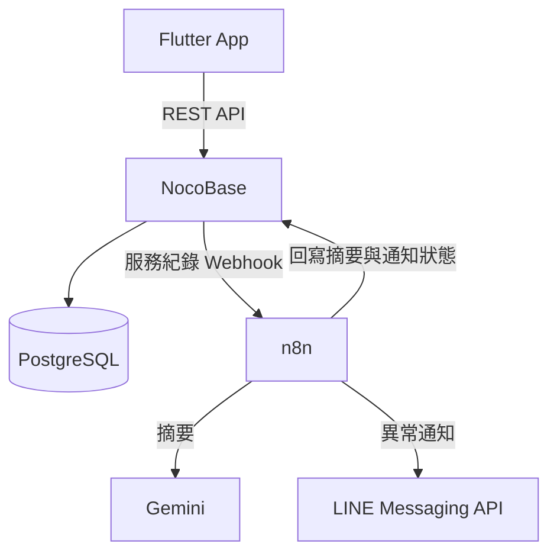
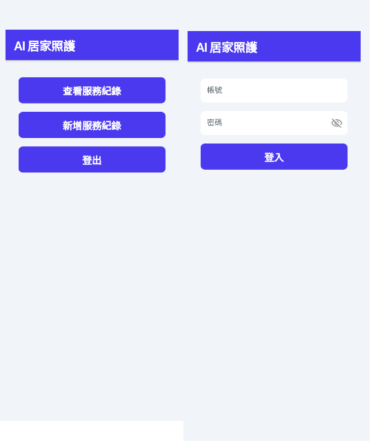
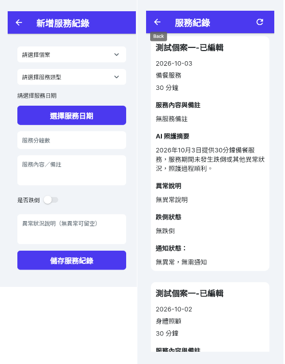

# AI Home Care Service & Incident Management System

> 中文名稱：AI 居家照護服務與異常管理系統
> 專案代號：CareFlow AI

以居家照護服務紀錄為情境的作品集系統。照服員可透過 Flutter App 登入、選擇個案並新增服務紀錄；NocoBase 保存資料，n8n 呼叫 Gemini 產生繁體中文摘要，偵測跌倒或異常說明後透過 LINE Messaging API 發送通知。

## Project Status

目前已發布 **v1.0.0 Initial Portfolio Release**，MVP 功能與主要例外流程均已完成測試。

- [x] Docker Compose 開發環境
- [x] PostgreSQL、NocoBase、n8n、Mailpit
- [x] NocoBase 個案與服務紀錄資料模型
- [x] n8n Gemini 摘要、異常判斷及 LINE 通知
- [x] FlutterFlow 登入、紀錄清單及新增紀錄
- [x] 載入、空資料、錯誤與重試狀態
- [x] 320 px 窄螢幕版面測試
- [x] 建立 GitHub v1.0.0 Release

## Architecture



## Main Features

- NocoBase 帳號登入與 Token 驗證
- 動態載入個案下拉選單
- 新增服務日期、類型、分鐘數、備註、跌倒與異常說明
- 服務紀錄清單及 AI 摘要顯示
- 輸入驗證、載入、空資料、錯誤及重新載入狀態
- Gemini 生成 80 字內繁體中文照護摘要
- 跌倒或異常說明觸發 LINE 通知
- 通知成功後更新 `alert_sent`

## Technology Stack

- Flutter / FlutterFlow
- NocoBase `2.1.31-full`
- n8n `2.20.7`
- PostgreSQL `16.15-alpine`
- Mailpit `1.30.4`
- Cloudflare Quick Tunnel
- Gemini API
- LINE Messaging API

## Repository Structure

```text
.
├── app/                         # FlutterFlow 匯出的 Flutter 專案
├── docker/postgres/init/        # PostgreSQL 初始化 SQL
├── docs/                        # 設定文件與測試畫面
├── n8n/workflows/               # 可匯入的 n8n 工作流程
├── .env.example                 # 不含秘密資料的設定範本
└── docker-compose.yml
```

## Local Setup

### 1. Prepare environment variables

```bash
cp .env.example .env
```

將 `.env` 內所有 `CHANGE_ME` 值改為本機專用的高強度隨機值。`.env` 已由 `.gitignore` 排除。

### 2. Start backend services

```bash
docker compose up -d
docker compose ps
```

本機服務：

- NocoBase：`http://localhost:13001`
- n8n：`http://localhost:5679`
- Mailpit：`http://localhost:8026`

取得 NocoBase Quick Tunnel 網址：

```bash
docker compose logs cloudflared-nocobase
```

Quick Tunnel 網址每次重建都可能改變，只適合開發與展示。

### 3. Configure NocoBase

依 [NocoBase schema](docs/nocobase-schema.md) 建立 Collections、欄位、關聯與自動化專用角色。

### 4. Import n8n workflow

匯入 `n8n/workflows/ai-home-care-service-record-automation.json`，再設定 Webhook Header Auth、Gemini API、NocoBase 服務登入及 LINE Messaging API 四組 Credentials。確認完成後再啟用工作流程。

### 5. Run Flutter App

Flutter 專案不保存正式後端網址。啟動時以 `NOCOBASE_BASE_URL` 傳入本機或 Quick Tunnel 網址：

```bash
cd app
flutter pub get
flutter run --dart-define=NOCOBASE_BASE_URL=https://YOUR-NOCOBASE-HOST
```

Android Emulator 連接本機 NocoBase 時，可使用 `http://10.0.2.2:13001`。

## Screenshots





## Security and Privacy

- Repository 僅使用虛構測試資料。
- 不提交 `.env`、Token、API Key、Credential、Pinned Data 或執行紀錄。
- Flutter App 的後端網址由 `--dart-define` 注入。
- n8n 公開工作流程不含 Credential ID、Instance ID 或 Webhook 測試資料。
- AI 摘要僅供展示與人工審核，不構成醫療建議。

## Known Limitations

- Cloudflare Quick Tunnel 沒有固定網址，不適合作為正式部署方案。
- AI 摘要為非同步產生；清單可能需要重新整理後才會顯示最新摘要。
- 本 Repository 提供開發與作品展示環境，尚未包含正式網域、TLS 管理、備份及監控方案。

## License

尚未指定授權條款。在加入 LICENSE 前，保留所有權利。
